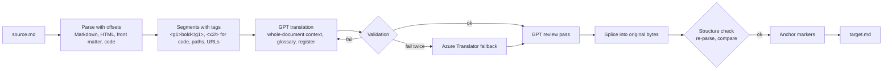

# mdtranslator

Translates Markdown files into the 24 official EU languages (configurable, e.g. Chinese or Japanese can be added) while keeping every byte that is not translatable text identical: Markdown syntax, HTML tags, file names, paths, URLs, inline code and source code. Code comments inside fenced code blocks are translated, the code itself is not.

It runs as a Docker container with a small REST API and uses Azure services:

| Service | Role |
|---|---|
| Microsoft Foundry, GPT-5.5 (EU data zone) | Document analysis, translation, review pass |
| Azure Translator (same Foundry resource) | Fallback for segments that fail validation |
| Azure Container Apps + Container Registry (optional) | Hosting with managed identity |

## Contents

- [How it works](#how-it-works)
- [Measured quality (impact of the reviewer)](#measured-quality-impact-of-the-reviewer)
- [Deploy the Azure side](#deploy-the-azure-side)
- [Build the image](#build-the-image)
- [Run the container](#run-the-container)
- [Authentication and managed identity](#authentication-and-managed-identity)
- [Test against the container](#test-against-the-container)
- [REST API](#rest-api)
- [Configuration reference](#configuration-reference)
- [Development, tests and evaluation](#development-tests-and-evaluation)
- [Project layout](#project-layout)

## How it works

No model ever sees or rewrites the raw Markdown. The file is parsed into a syntax tree with exact offsets, only translatable text is extracted, translated and spliced back into the original byte buffer.



What is translated and what is kept:

| Element | Handling |
|---|---|
| Paragraphs, headings, list items, table cells, footnotes | Translated as whole blocks so word order can change; inline markup stays attached to the right words |
| Image alt text, link and image titles, HTML `alt` / `title` / `aria-label` | Translated |
| HTML tags and attributes (`<strong>`, `<table>`, `class`, `href`...) | Unchanged; text between tags is translated |
| `<code>`, `<kbd>`, `<pre>`, `<script>`, `translate="no"`, HTML comments | Unchanged |
| File names and paths (`test.jpeg`, `./scripts/deploy.ps1`, `C:\temp`), URLs, e-mail, variables (`$HOME`, `%APPDATA%`, `${VAR}`), CLI flags, versions, GUIDs, identifiers (`camelCase`, `snake_case`, `Get-AzContext`), glossary terms | Unchanged, also inside backticks, image references and attributes |
| Fenced code | Code bytes unchanged; comments translated (line and block comments, JSDoc/XML doc tags kept). Parsed with tree-sitter (JS, TS, Python, Bash, PowerShell, C#, C/C++, Java, Go, Rust, Ruby, PHP, CSS, INI) or a lexer (Bicep, Terraform, SQL, KQL, YAML, TOML, Dockerfile, XML/HTML, and more) |
| Commented-out code, lint/pragma directives, shebangs, license headers, Python docstrings | Unchanged |
| Front matter | Only `title`, `description`, `summary` and similar prose keys |
| Headings | Translated; an empty `<a id="old-slug"></a>` is inserted so existing `#old-slug` links keep working |
| Shortcut references `[Contoso]` | Become `[Übersetzt][Contoso]` only when the label text changed |

Formality is discovered per document (a front matter `formality: informal` key or the request option overrides it); the default is formal. Per-language rules such as German "Sie", Swedish "du", European Portuguese vocabulary or French punctuation live in [config/languages.json](config/languages.json).

Every translated segment passes validation before it is used: all tags present exactly once and correctly nested, no comment terminators such as `*/` inside comments, length ratio sanity check, and a re-parse proving the inline structure is unchanged. After splicing, the whole document is parsed again and compared node by node with the source. A block that would change the structure is reverted to the source text and listed in the report, so the output is always valid.

## Measured quality (impact of the reviewer)

Measured with [eval/run.ts](eval/run.ts) on 3 documents (quickstart, informal blog post, concepts) in German, French, Swedish, Polish, Finnish and Maltese. Two GPT judges (GPT-5.5 and GPT-5.6-sol) compared the variants blind, each segment twice with swapped order; a win only counts when both orders agree. Error score is MQM style, severity weighted per 100 source words (minor 1, major 5, critical 10), lower is better.

| Comparison | Won / lost | Error score | Decision |
|---|---|---|---|
| GPT-5.5 vs Azure Translator (NMT) | 567 / 3 | 2.09 vs 26.35 | GPT is the primary translator |
| GPT-5.5 + review vs GPT-5.5 | 76 / 0 | 0.21 vs 1.98 | Review pass on by default |
| GPT-5.6-sol vs GPT-5.5 | 183 / 124 | 3.23 vs 3.55 | Stay on GPT-5.5 (gain mostly from the self-judging model, clear regression in Polish) |

Impact of the review pass by language:

| Language | Without review | With review | Won / lost |
|---|---|---|---|
| Maltese | 4.83 | 0.40 | 26 / 0 |
| Finnish | 2.66 | 0.32 | 20 / 0 |
| French | 1.43 | 0.40 | 11 / 0 |
| Polish | 1.21 | 0.06 | 5 / 0 |
| German | 1.02 | 0.06 | 8 / 0 |
| Swedish | 0.70 | 0.02 | 6 / 0 |

The reviewer changed about 10% of the segments and fixed real errors (mistranslated idioms, wrong verb mood, missing words, literal calques). The independent judge (GPT-5.6-sol, not the reviewer model) also scored it 38 / 0. Cost: about twice the time and tokens (39 s to 74 s per document). Structure: 0 reverted blocks, 0 segments kept in the source language, 0 fallbacks across 72 document translations.

Caveats: LLM judges instead of human linguists, and a small corpus. Re-run the evaluation on your own documents before relying on the numbers.

## Deploy the Azure side

Requirements: Az PowerShell (`Az.Accounts`, `Az.Resources`, `Az.CognitiveServices`, `Az.ContainerRegistry`), Bicep CLI, Docker.

[infra/main.bicep](infra/main.bicep) creates:

- Foundry resource (`AIServices`) with model deployments and Azure Translator access
- User-assigned managed identity with `Cognitive Services OpenAI User` and `Cognitive Services User` on the Foundry resource
- Optional: data-plane roles for a developer user (for local testing with your own login)
- Optional (`deployApp`): Log Analytics, Container Registry (admin user disabled, pull via managed identity), Container Apps environment and the API app

Parameters:

| Parameter | Default | Description |
|---|---|---|
| `location` | resource group location | Region |
| `namePrefix` | `mdt` | Prefix for resource names |
| `allowApiKeys` | `true` | Allow key auth on the Foundry resource (a policy may still force it off) |
| `modelDeployments` | GPT-5.5 as `translate` | Array of `{ name, format, model, version, sku, capacity }`; the first entry is the default translator |
| `developerPrincipalId` | empty | Object id of a user who gets data-plane access |
| `deployApp` | `false` | Also deploy registry and Container Apps hosting |
| `containerImage` | empty | Image for the Container App (needed when `deployApp` is true) |
| `apiAuthKey` | empty (secure) | Value clients must send in `x-api-key` to the hosted API |

[infra/main.bicepparam](infra/main.bicepparam) additionally deploys `translate-alt` (GPT-5.6-sol), used only by the evaluation; remove it if you do not run evaluations.

### 1. Helper services only

```powershell
Set-AzContext -Subscription '<subscription name or id>'
$rg = '<resource-group>'
$me = (Get-AzADUser -SignedIn).Id
$d = New-AzResourceGroupDeployment -ResourceGroupName $rg `
      -TemplateFile infra/main.bicep -TemplateParameterFile infra/main.bicepparam `
      -developerPrincipalId $me
$d.Outputs | Format-Table
```

Put the outputs into `.env` (copy [.env.example](.env.example)):

```
AZURE_OPENAI_ENDPOINT=<openAiEndpoint>
AZURE_TRANSLATOR_ENDPOINT=<translatorEndpoint>
AZURE_TRANSLATOR_REGION=<translatorRegion>
AZURE_TENANT_ID=<tenant id of the subscription>
MDT_TRANSLATE_DEPLOYMENT=translate
```

### 2. Optional: host the API on Azure Container Apps

```powershell
# a) create registry and environment
New-AzResourceGroupDeployment -ResourceGroupName $rg -TemplateFile infra/main.bicep `
  -TemplateParameterFile infra/main.bicepparam -developerPrincipalId $me -deployApp $true

# b) build and push the image (add --build-arg NPM_REGISTRY=... behind a package proxy, see below)
$acr = '<acrLoginServer output>'
docker build -t "$acr/mdtranslator:1.0.1" .
Connect-AzContainerRegistry -Name ($acr -split '\.')[0]
docker push "$acr/mdtranslator:1.0.1"

# c) deploy the app; it authenticates to Foundry with the managed identity
$key = [guid]::NewGuid().ToString('N')
New-AzResourceGroupDeployment -ResourceGroupName $rg -TemplateFile infra/main.bicep `
  -TemplateParameterFile infra/main.bicepparam -developerPrincipalId $me -deployApp $true `
  -containerImage "$acr/mdtranslator:1.0.1" -apiAuthKey (ConvertTo-SecureString $key -AsPlainText -Force)
```

The `apiUrl` output is the public endpoint; clients send `$key` in the `x-api-key` header.

## Build the image

Without a package proxy (direct internet access to registry.npmjs.org):

```powershell
docker build -t mdtranslator:local .
```

With a package proxy or mirror (Artifactory, Nexus, Azure Artifacts upstream feed, Verdaccio...), pass its npm registry URL. The build rewrites the lockfile's `registry.npmjs.org` tarball URLs to it, so the same lockfile works in both cases:

```powershell
docker build --build-arg NPM_REGISTRY=https://<your-npm-proxy>/<path>/ -t mdtranslator:local .
# or, with the helper script:
$env:NPM_REGISTRY = 'https://<your-npm-proxy>/<path>/'
./run-container.ps1 -Build
```

The URL must end with `/`. If the proxy needs credentials, provide an `.npmrc` through a [BuildKit secret](https://docs.docker.com/build/building/secrets/) rather than a build argument, so the credentials do not end up in the image. For local development without Docker, point npm at the proxy with `npm config set registry https://<your-npm-proxy>/<path>/` (npm then also resolves the lockfile's public URLs through it).

## Run the container

The easy way (builds the image if missing, gets an Entra token, generates an API key, prints test commands):

```powershell
./run-container.ps1 -Port 8080
```

| Parameter | Default | Description |
|---|---|---|
| `-Port` | `8080` | Host port |
| `-Image` | `mdtranslator:local` | Image name |
| `-Build` | off | Force rebuilding the image |
| `-ApiKey` | generated | Key clients must send in `x-api-key`; stored in `.mdt-local-key` for `send-file.ps1` while the container runs |
| `-Subscription` | current Az context | Subscription used to get the token |
| `-EnvFile` | `.env` | Environment file passed to the container |
| `-NpmRegistry` | `$env:NPM_REGISTRY`, else public npm | Package proxy used when building the image |

Manually:

```powershell
docker build -t mdtranslator:local .
$env:AZURE_AI_ACCESS_TOKEN = (Get-AzAccessToken -ResourceUrl https://cognitiveservices.azure.com -TenantId (Get-AzContext).Tenant.Id).Token | ConvertFrom-SecureString -AsPlainText
$env:MDT_API_KEY = 'choose-a-key'
docker run --rm -it -p 8080:8080 --env-file .env -e AZURE_AI_ACCESS_TOKEN -e MDT_API_KEY mdtranslator:local
```

All options are environment variables, see the [configuration reference](#configuration-reference).

## Authentication and managed identity

The service picks the first option that is configured:

| Order | Setting | Use case |
|---|---|---|
| 1 | `AZURE_AI_API_KEY` | Key auth (local testing, where keys are allowed) |
| 2 | `AZURE_AI_ACCESS_TOKEN` | Pre-acquired Entra token, local container tests only (expires after about 1 hour) |
| 3 | `AZURE_CLIENT_ID` | User-assigned managed identity (Container Apps, AKS workload identity, VMs) |
| 4 | none of the above | `DefaultAzureCredential`: system-assigned managed identity, service principal env vars, Az PowerShell / VS Code login. Set `AZURE_TENANT_ID` if your login defaults to another tenant |

Note: some organizations enforce `disableLocalAuth=true` on Azure AI resources through Azure Policy, even when the Bicep sets `allowApiKeys=true`. API keys then cannot be used; use options 2 to 4.

To enable managed identity outside the provided Bicep:

1. Create or enable a managed identity on the compute (Container Apps, App Service, AKS, VM).
2. Assign it `Cognitive Services OpenAI User` and `Cognitive Services User` on the Foundry resource.
3. Set `AZURE_CLIENT_ID` to the identity's client id (user-assigned) or leave it empty (system-assigned).
4. Do not set `AZURE_AI_API_KEY` or `AZURE_AI_ACCESS_TOKEN`.

With `deployApp=true` the Bicep does all of this for the hosted API.

Protecting the API itself: set `MDT_API_KEY`; clients then send it in the `x-api-key` header (`/healthz` stays open). Without it the API accepts unauthenticated requests and logs a warning; use that only locally.

## Test against the container

```powershell
./send-file.ps1 -Port 8080 -InFile .\docs\guide.md -Target de -OutFile .\docs\guide.de.md -Report
```

| Parameter | Default | Description |
|---|---|---|
| `-Port` | `8080` | Container port |
| `-InFile` | required | Markdown file |
| `-Target` | required | Language code (`de`, `fr`, `pt`, `mt`, ...) |
| `-OutFile` | `<name>.<target>.md` next to the input | Output file |
| `-ApiKey` | `$env:MDT_API_KEY`, then `.mdt-local-key` | API key |
| `-Formality` | discovered | `formal` or `informal` |
| `-NoReview` | off | Skip the review pass (faster, lower quality) |
| `-Report` | off | Print segments, fallbacks, review edits, reverted blocks, anchors |
| `-TimeoutSec` | `900` | HTTP timeout |

The file is read and written as raw UTF-8 bytes, so BOM and line endings survive. Check the result with `code --diff .\docs\guide.md .\docs\guide.de.md`.

Against the hosted API, use `Invoke-RestMethod` with the hosted URL and key (see [REST API](#rest-api)).

## REST API

Base URL: `http://localhost:8080` locally, or the `apiUrl` Bicep output. All endpoints except `/healthz` require the `x-api-key` header when `MDT_API_KEY` is set.

### `POST /translate/{lang}`

Translates one or more files into one language.

```http
POST /translate/de
Content-Type: application/json; charset=utf-8
x-api-key: <key>

{ "main.md": "# Hello\n\nOpen **config.json**.", "docs/setup.md": "..." }
```

Response:

```json
{ "main.md": "# <a id=\"hello\"></a>Hallo\n\nÖffnen Sie **config.json**.", "docs/setup.md": "..." }
```

### `POST /translate?to=fr,sv`

Same body; translates into several languages in parallel. Without `to` all `defaultTargets` from `config/languages.json` are used.

```json
{ "fr": { "main.md": "..." }, "sv": { "main.md": "..." } }
```

### Query options (both endpoints)

| Option | Values | Description |
|---|---|---|
| `formality` | `formal`, `informal` | Override the discovered register |
| `review` | `true`, `false` | Enable or skip the review pass (default `MDT_REVIEW`) |
| `engine` | `gpt`, `nmt` | `nmt` uses only Azure Translator |
| `sourceLanguage` | BCP-47, e.g. `en` | Skip source language detection |
| `doNotTranslate` | comma-separated terms | Additional protected terms |
| `includeReport` | `true` | Wrap the response: `{ "files": {...}, "report": [...], "usage": {...} }` (multi-language: `{ "translations": {...}, ... }`) |

Report entry per file and language: `formality`, `segments`, `via` (gpt, nmt, cache, source), `retried`, `reviewEdits`, `keptSource` (segments left untranslated, with reasons), `revertedForStructure`, `anchorsAdded`, `untranslatedWarnings`, `notes`, `error`.

### Other endpoints

| Endpoint | Description |
|---|---|
| `GET /healthz` | `{ "status": "ok" }`, no auth |
| `GET /languages` | `{ "defaultTargets": [...], "languages": [{ "code", "name" }] }` |

### Errors and limits

| Status | Meaning |
|---|---|
| 400 | Body is not `{ "file": "text" }`, invalid option |
| 401 | Missing or wrong `x-api-key` |
| 422 | Unknown target language (response lists supported codes) |
| 500 | Unexpected failure |

Limits: 500 files and 25 MB per request (`MDT_BODY_LIMIT_BYTES`). A file that fails completely is returned unchanged and the reason is in the report. Container Apps ends HTTP requests after about 240 seconds, so for many languages send one request per language.

Example with PowerShell:

```powershell
$h = @{ 'x-api-key' = '<key>' }
$body = @{ 'main.md' = (Get-Content .\README.md -Raw) } | ConvertTo-Json
$r = Invoke-RestMethod -Method Post 'http://localhost:8080/translate?to=fr,de&includeReport=true' -Headers $h `
       -ContentType 'application/json; charset=utf-8' -Body ([Text.Encoding]::UTF8.GetBytes($body)) -TimeoutSec 900
$r.translations.fr.'main.md'
$r.report | Format-Table file, language, segments, reviewEdits
```

## Configuration reference

| Variable | Default | Description |
|---|---|---|
| `AZURE_OPENAI_ENDPOINT` | | `https://<account>.openai.azure.com` |
| `AZURE_TRANSLATOR_ENDPOINT` | | `https://<account>.cognitiveservices.azure.com` (fallback is disabled when empty) |
| `AZURE_TRANSLATOR_REGION` | | Region, needed for key auth |
| `AZURE_AI_API_KEY` | | Key auth for Foundry and Translator |
| `AZURE_AI_ACCESS_TOKEN` | | Static Entra token (local tests only) |
| `AZURE_CLIENT_ID` | | User-assigned managed identity |
| `AZURE_TENANT_ID` | | Tenant for developer logins |
| `MDT_TRANSLATE_DEPLOYMENT` | `translate` | Model deployment for translation |
| `MDT_REVIEW_DEPLOYMENT` | same as translate | Model deployment for the review pass |
| `MDT_ANALYSIS_DEPLOYMENT` | same as translate | Model deployment for document analysis |
| `MDT_TRANSLATE_REASONING` | `medium` | Reasoning effort for translation |
| `MDT_REVIEW_REASONING` | `high` | Reasoning effort for review |
| `MDT_REVIEW` | `true` | Review pass on or off |
| `MDT_NMT_FALLBACK` | `true` | Azure Translator fallback on or off |
| `MDT_PRESERVE_ANCHORS` | `true` | Insert anchors for the original heading slugs |
| `MDT_SOURCE_LANGUAGE` | detected | Fixed source language |
| `MDT_MAX_CONCURRENCY` | `16` | Parallel model calls |
| `MDT_BATCH_MAX_SEGMENTS` | `40` | Segments per model call |
| `MDT_BATCH_MAX_CHARS` | `12000` | Characters per model call |
| `MDT_CONTEXT_MAX_CHARS` | `60000` | Document context sent with each call |
| `MDT_REQUEST_TIMEOUT_MS` | `600000` | Timeout per model call |
| `MDT_CACHE_DIR` | memory only | Directory for the segment translation memory |
| `MDT_API_KEY` | | Protects the REST API (`x-api-key`) |
| `MDT_BODY_LIMIT_BYTES` | 25 MB | Maximum request size |
| `MDT_LANGUAGES_FILE` | `config/languages.json` | Language catalog |
| `MDT_GLOSSARY_FILE` | `config/glossary.json` | Protected terms and preferred translations |
| `PORT` | `8080` | HTTP port |
| `LOG_LEVEL` | `info` | Fastify log level |

Languages: add an entry to `config/languages.json` (name, Translator code, formal/informal guidance, style notes, optional `wrap: "none"` and `lengthRatio` for CJK) and optionally list it in `defaultTargets`. `zh-Hans`, `ja`, `ko`, `nb` and `uk` are already defined.

Glossary: `doNotTranslate` terms are always protected; `terms` maps source terms to required translations per language.

## Development, tests and evaluation

```powershell
npm install
npm test                                              # 91 byte-identity and validation tests, offline
npm run dev                                           # API on :8080 with the local .env
npx tsx scripts/translate.ts de,fr path\to\file.md    # translate files to .\out
npx tsx eval/run.ts                                   # quality evaluation (EVAL_LANGS, EVAL_DOCS, EVAL_JUDGES)
```

Evaluation results are written to `eval/results/`; put your own documents into `eval/corpus/` to measure them.

## Project layout

| Path | Content |
|---|---|
| `src/markdown/` | Parsing, segment extraction, HTML, front matter, rendering, wrapping, anchors, structure check |
| `src/code/` | Comment detection (tree-sitter and lexers) and comment segments |
| `src/mask/` | Protected spans (paths, URLs, identifiers) and tag handling |
| `src/translate/` | Prompts, engine (batching, retries, fallback, review), validation, cache |
| `src/azure/` | Auth (key, token, managed identity), Foundry chat client, Translator client |
| `src/pipeline.ts`, `src/server.ts` | Orchestration and REST API |
| `config/` | Languages and glossary |
| `infra/` | Bicep and parameters |
| `test/` | Unit tests and fixtures |
| `eval/` | Evaluation harness and corpus |
| `run-container.ps1`, `send-file.ps1` | Local container helpers |
