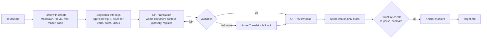

# mdtranslator

Translates Markdown files into the 24 official EU languages (configurable, e.g. Chinese or Japanese can be added) while keeping every byte that is not translatable text identical: Markdown syntax, HTML tags, file names, paths, URLs, inline code and source code. Code comments inside fenced code blocks are translated, the code itself is not.

It runs as a Docker container with a small REST API and uses Azure services:

| Service | Role |
|---|---|
| Microsoft Foundry, GPT-5.5 (EU data zone) | Document analysis, translation, review pass |
| Azure Translator (same Foundry resource) | Fallback for segments that fail validation |
| Azure Container Apps + Container Registry (optional) | Hosting with managed identity |

## Contents

- [How it works](#how-it-works)
- [Measured quality (impact of the reviewer)](#measured-quality-impact-of-the-reviewer)
- [Feature switches](#feature-switches)
- [Deploy the Azure side](#deploy-the-azure-side)
- [Build the image](#build-the-image)
- [Run the container](#run-the-container)
- [Authentication and managed identity](#authentication-and-managed-identity)
- [Test against the container](#test-against-the-container)
- [REST API](#rest-api)
- [Command-line binary (Rust)](#command-line-binary-rust)
- [Configuration reference](#configuration-reference)
- [Evaluation and tests](#evaluation-and-tests)
- [Project layout](#project-layout)

## How it works

No model ever sees or rewrites the raw Markdown. The file is parsed into a syntax tree with exact offsets, only translatable text is extracted, translated and spliced back into the original byte buffer.



What is translated and what is kept:

| Element | Handling |
|---|---|
| Paragraphs, headings, list items, table cells, footnotes | Translated as whole blocks so word order can change; inline markup stays attached to the right words |
| Image alt text, link and image titles, HTML `alt` / `title` / `aria-label` | Translated |
| HTML tags and attributes (`<strong>`, `<table>`, `class`, `href`...) | Unchanged; text between tags is translated |
| `<code>`, `<kbd>`, `<pre>`, `<script>`, `translate="no"`, HTML comments | Unchanged |
| File names and paths (`test.jpeg`, `./scripts/deploy.ps1`, `C:\temp`), URLs, e-mail, variables (`$HOME`, `%APPDATA%`, `${VAR}`), CLI flags, versions, GUIDs, identifiers (`camelCase`, `snake_case`, `Get-AzContext`), glossary terms | Unchanged, also inside backticks, image references and attributes |
| Fenced code | Code bytes unchanged; comments translated (line and block comments, JSDoc/XML doc tags kept). Parsed with tree-sitter (JS, TS, Python, Bash, PowerShell, C#, C/C++, Java, Go, Rust, Ruby, PHP, CSS, INI) or a lexer (Bicep, Terraform, SQL, KQL, YAML, TOML, Dockerfile, XML/HTML, and more) |
| Commented-out code, lint/pragma directives, shebangs, license headers | Unchanged. Commented-out code is detected by parsing the comment text with the block's own tree-sitter grammar (plus heuristics for lexer-only languages) |
| Python docstrings | Translated (detected with tree-sitter); quotes and indentation are kept. Google (`Args:`, `name (type):`), NumPy (`Parameters` + `----------`, `name : type`) and reST (`.. note::`, `:param x:`) structure, `>>>` doctest blocks and `::` literal blocks stay unchanged. Disable with `docstrings=false` |
| Front matter | Parsed as YAML: prose keys (`title`, `description`, `summary`, ...) at any depth (`seo.title`, `nav[].title`), `keywords` lists, plain, quoted, folded (`>`) and literal (`\|`) scalars. Indicators, indentation and quoting style are kept |
| Math | `$$...$$` inline and block math unchanged. Single-dollar spans that look like formulas (`$\alpha = 0.7$`, `$x_1$`, `$s$`) are protected even with the switch off; prices like "$5 and $10" or "$20,000 and $30,000" stay prose. `MDT_MATH_SINGLE_DOLLAR=true` additionally parses those formulas as math nodes |
| Admonitions and directives | `:::note[Title]`, `::leaf[label]{attrs}` (remark-directive), Docusaurus `:::tip Title` and GitHub alerts `> [!NOTE]`: fences and names unchanged, titles and content translated, line structure kept |
| Microsoft Docs syntax | `[!INCLUDE [title](path)]`, `:::image ... alt-text="..." :::`, `:::zone pivot="..."`: only the include title and `alt-text` are translated |
| Hugo shortcodes | ``, `{}`: shortcode names and paths unchanged, `title` / `alt` / `caption` values translated |
| MDX (`.mdx` files) | Parsed as MDX: `import`/`export` and `{expressions}` unchanged; text inside JSX components and prose attributes (`label`, `title`, `alt`, ...) translated |
| Headings | Translated; an empty `<a id="old-slug"></a>` is inserted so existing `#old-slug` links keep working |
| Shortcut references `[Contoso]` | Become `[Übersetzt][Contoso]` only when the label text changed |

Each segment also carries its position in the document (section path, table column and row, the sentence that introduces a list, the surrounding admonition or component). With `MDT_STRUCTURAL_CONTEXT=true` (off by default, see [Feature switches](#feature-switches)) this is sent to the model as a hint for short, ambiguous segments such as a table cell "Run" or a button label.

Formality is discovered per document (a front matter `formality: informal` key or the request option overrides it); the default is formal. Per-language rules such as German "Sie", Swedish "du", European Portuguese vocabulary or French punctuation live in [config/languages.json](config/languages.json).

Every translated segment passes validation before it is used: all tags present exactly once and correctly nested, directive and shortcode tags in their original order, no quotes leaking into attribute values, no comment terminators such as `*/` inside comments, length ratio sanity check, and a re-parse proving the inline structure is unchanged. After splicing, the whole document is parsed again and compared node by node with the source. A block that would change the structure is reverted to the source text and listed in the report, so the output is always valid.

## Measured quality (impact of the reviewer)

The complete, current evidence for every feature switch (66-document corpus, German and French, multi-model judge panel, charts, regression history) is in [evaluation/README.md](evaluation/README.md). The numbers below come from the earlier engine comparison.

Measured with [eval/run.ts](eval/run.ts) on 3 documents (quickstart, informal blog post, concepts) in German, French, Swedish, Polish, Finnish and Maltese. Two GPT judges (GPT-5.5 and GPT-5.6-sol) compared the variants blind, each segment twice with swapped order; a win only counts when both orders agree. Error score is MQM style, severity weighted per 100 source words (minor 1, major 5, critical 10), lower is better.

| Comparison | Won / lost | Error score | Decision |
|---|---|---|---|
| GPT-5.5 vs Azure Translator (NMT) | 567 / 3 | 2.09 vs 26.35 | GPT is the primary translator |
| GPT-5.5 + review vs GPT-5.5 | 76 / 0 | 0.21 vs 1.98 | Review pass on by default |
| GPT-5.6-sol vs GPT-5.5 | 183 / 124 | 3.23 vs 3.55 | Stay on GPT-5.5 (gain mostly from the self-judging model, clear regression in Polish) |

Impact of the review pass by language:

| Language | Without review | With review | Won / lost |
|---|---|---|---|
| Maltese | 4.83 | 0.40 | 26 / 0 |
| Finnish | 2.66 | 0.32 | 20 / 0 |
| French | 1.43 | 0.40 | 11 / 0 |
| Polish | 1.21 | 0.06 | 5 / 0 |
| German | 1.02 | 0.06 | 8 / 0 |
| Swedish | 0.70 | 0.02 | 6 / 0 |

The reviewer changed about 10% of the segments and fixed real errors (mistranslated idioms, wrong verb mood, missing words, literal calques). The independent judge (GPT-5.6-sol, not the reviewer model) also scored it 38 / 0. Cost: about twice the time and tokens (39 s to 74 s per document). Structure: 0 reverted blocks, 0 segments kept in the source language, 0 fallbacks across 72 document translations.

Impact of structural context (`MDT_STRUCTURAL_CONTEXT`), measured separately on 4 documents (the 3 above plus a table-heavy settings reference) in the same 6 languages, without the review pass:

| Scope | Won / lost | Error score with / without | Significance (sign test) |
|---|---|---|---|
| Overall | 185 / 128 | 3.02 / 3.68 | p = 0.002 |
| Judge GPT-5.5 | 115 / 66 | 2.45 / 3.38 | p < 0.001 |
| Judge GPT-5.6-sol | 70 / 62 | 3.59 / 3.98 | p = 0.54 (not significant) |
| Quickstart (procedures, tables, UI) | 73 / 30 | 2.11 / 4.40 | p < 0.001 |
| Settings reference (tables of short values) | 28 / 28 | 6.95 / 5.67 | none |
| Blog post, concepts (prose) | 84 / 70 | about equal | none |

In this early measurement (without the review pass) structural context won significantly with one judge but not with the other. The full feature evaluation measures it in the shipped configuration, with the review pass on, and there it brings no improvement at a higher cost, so it is now off by default (see [Feature switches](#feature-switches)).

Caveats: LLM judges instead of human linguists, and a small corpus. Re-run the evaluation on your own documents before relying on the numbers.

## Feature switches

Every feature can be switched per request with a query parameter and per deployment with an environment variable. The request value wins over the environment variable. Query values: `true`/`false`, `1`/`0`, `yes`/`no`, `on`/`off`; anything else returns 400.

Rule for the defaults: a feature that changes translation quality is on only if the evaluation shows a significant improvement. Features with a measured degradation or no significant improvement are off and must be enabled explicitly. Features that implement a correctness requirement (code comments, docstrings, front matter, anchors) are on because turning them off leaves text untranslated or breaks links.

Evidence: the feature evaluation in [evaluation/README.md](evaluation/README.md) (68 documents, German and French, four judges from two model families; each switch flipped alone against the defaults). "Won / lost" counts blocks where the judge panel preferred the output with the feature on or off; the error score is MQM penalty points per 100 source words; "problems" are deterministic defects (protected content changed, expected text left in English, structure, code or link breaks).

| Query parameter | Environment variable | Default | What it does | Evidence for the default |
|---|---|---|---|---|
| `review` | `MDT_REVIEW` | on | Second GPT pass (reasoning high) that checks every translation against the source and fixes errors | Won 203, lost 7 (p < 0.001); error score 2.71 with vs 29.00 without; also 183 / 7 for the independent (Anthropic) judge. About doubles tokens |
| `structuralContext` | `MDT_STRUCTURAL_CONTEXT` | **off** | Sends each segment's position (section, table column and row, list lead-in, admonition) to the model | No significant improvement with the review pass on: won 108, lost 128 (p 0.43), error score 3.35 with vs 2.75 without, about 14% more tokens; the independent judge sees 43 / 49. Earlier gains were measured without the review pass |
| `nmtFallback` | `MDT_NMT_FALLBACK` | on | Azure Translator translates a segment that failed GPT validation twice | Safety net: without it such a segment stays in the source language. Never triggered (0 of 136 translations), so it cannot degrade normal output |
| `preserveAnchors` | `MDT_PRESERVE_ANCHORS` | on | Inserts `<a id="old-slug"></a>` into translated headings so `#old-slug` links keep working | Problems 22 with vs 76 without; the difference is broken in-page links. No effect on translation text |
| `codeComments` | `MDT_CODE_COMMENTS` | on | Translates comments in fenced code. Off: code blocks stay byte-identical, including comments | Won 56, lost 12 (p < 0.001); problems 22 with vs 351 without; code bytes unchanged either way |
| `docstrings` | `MDT_DOCSTRINGS` | on | Translates Python docstrings (needs `codeComments`). Off: docstrings unchanged and listed in the report | Won 13, lost 1 (p 0.005); problems 22 with vs 169 without; Google, NumPy and reST structure stays intact |
| `frontMatter` | `MDT_FRONT_MATTER` | on | Translates prose keys in YAML front matter. Off: front matter byte-identical; `formality:` is still read | Won 17, lost 0 (p < 0.001); error score 0.11 with vs 44.38 without |
| `mdx` | none | on for `.mdx` files | Parses the file as MDX (JSX, `{expressions}`, `import`/`export`) | `.mdx` files: won 7, lost 3, problems 0 vs 16. Forced on `.md` files: won 5, lost 146, problems 328 vs 22, so it follows the file extension |
| `mathSingleDollar` | `MDT_MATH_SINGLE_DOLLAR` | off | Parses `$...$` as inline math, following Pandoc's rules (opening `$` followed by a non-space, closing `$` after a non-space and not before a digit) plus a formula check (LaTeX command, operator, sub/superscript or a single variable) | Formulas are protected with the switch off as well, so the switch changed only 1 of 136 translations with no measurable difference. The first version turned prices such as "$5 and $10" into math (measured degradation) |

Other options that are not on/off switches: `engine=nmt` (Azure Translator only, error score 26.35 vs 2.09, not recommended), `formality`, `sourceLanguage`, `doNotTranslate`. The alternative model deployment (`MDT_TRANSLATE_DEPLOYMENT`, GPT-5.6-sol) is not the default: no independent improvement and a regression in Polish.

Example: fastest run for a Python API reference that keeps docstrings and code untouched:

```http
POST /translate/de?review=false&docstrings=false&codeComments=false
```

With the test script: `./send-file.ps1 -InFile .\api.md -Target de -Disable review,docstrings -Enable mathSingleDollar`.

## Deploy the Azure side

Requirements: Az PowerShell (`Az.Accounts`, `Az.Resources`, `Az.CognitiveServices`, `Az.ContainerRegistry`), Bicep CLI, Docker.

[infra/main.bicep](infra/main.bicep) creates:

- Foundry resource (`AIServices`) with model deployments and Azure Translator access
- User-assigned managed identity with `Cognitive Services OpenAI User` and `Cognitive Services User` on the Foundry resource
- Optional: data-plane roles for a developer user (for local testing with your own login)
- Optional (`deployApp`): Log Analytics, Container Registry (admin user disabled, pull via managed identity), Container Apps environment and the API app

Parameters:

| Parameter | Default | Description |
|---|---|---|
| `location` | resource group location | Region |
| `namePrefix` | `mdt` | Prefix for resource names |
| `allowApiKeys` | `true` | Allow key auth on the Foundry resource (a policy may still force it off) |
| `modelDeployments` | GPT-5.5 as `translate` | Array of `{ name, format, model, version, sku, capacity }`; the first entry is the default translator |
| `developerPrincipalId` | empty | Object id of a user who gets data-plane access |
| `deployApp` | `false` | Also deploy registry and Container Apps hosting |
| `containerImage` | empty | Image for the Container App (needed when `deployApp` is true) |
| `apiAuthKey` | empty (secure) | Value clients must send in `x-api-key` to the hosted API |

[infra/main.bicepparam](infra/main.bicepparam) additionally deploys `translate-alt` (GPT-5.6-sol), used only by the evaluation; remove it if you do not run evaluations.

### 1. Helper services only

```powershell
Set-AzContext -Subscription '<subscription name or id>'
$rg = '<resource-group>'
$me = (Get-AzADUser -SignedIn).Id
$d = New-AzResourceGroupDeployment -ResourceGroupName $rg `
      -TemplateFile infra/main.bicep -TemplateParameterFile infra/main.bicepparam `
      -developerPrincipalId $me
$d.Outputs | Format-Table
```

Put the outputs into `.env` (copy [.env.example](.env.example)):

```
AZURE_OPENAI_ENDPOINT=<openAiEndpoint>
AZURE_TRANSLATOR_ENDPOINT=<translatorEndpoint>
AZURE_TRANSLATOR_REGION=<translatorRegion>
AZURE_TENANT_ID=<tenant id of the subscription>
MDT_TRANSLATE_DEPLOYMENT=translate
```

### 2. Optional: host the API on Azure Container Apps

```powershell
# a) create registry and environment
New-AzResourceGroupDeployment -ResourceGroupName $rg -TemplateFile infra/main.bicep `
  -TemplateParameterFile infra/main.bicepparam -developerPrincipalId $me -deployApp $true

# b) build and push the image (add --build-arg NPM_REGISTRY=... behind a package proxy, see below)
$acr = '<acrLoginServer output>'
docker build -t "$acr/mdtranslator:1.0.1" .
Connect-AzContainerRegistry -Name ($acr -split '\.')[0]
docker push "$acr/mdtranslator:1.0.1"

# c) deploy the app; it authenticates to Foundry with the managed identity
$key = [guid]::NewGuid().ToString('N')
New-AzResourceGroupDeployment -ResourceGroupName $rg -TemplateFile infra/main.bicep `
  -TemplateParameterFile infra/main.bicepparam -developerPrincipalId $me -deployApp $true `
  -containerImage "$acr/mdtranslator:1.0.1" -apiAuthKey (ConvertTo-SecureString $key -AsPlainText -Force)
```

The `apiUrl` output is the public endpoint; clients send `$key` in the `x-api-key` header.

## Build the image

Without a package proxy (direct internet access to registry.npmjs.org):

```powershell
docker build -t mdtranslator:local .
```

With a package proxy or mirror (Artifactory, Nexus, Azure Artifacts upstream feed, Verdaccio...), pass its npm registry URL. The build rewrites the lockfile's `registry.npmjs.org` tarball URLs to it, so the same lockfile works in both cases:

```powershell
docker build --build-arg NPM_REGISTRY=https://<your-npm-proxy>/<path>/ -t mdtranslator:local .
# or, with the helper script:
$env:NPM_REGISTRY = 'https://<your-npm-proxy>/<path>/'
./run-container.ps1 -Build
```

The URL must end with `/`. If the proxy needs credentials, provide an `.npmrc` through a [BuildKit secret](https://docs.docker.com/build/building/secrets/) rather than a build argument, so the credentials do not end up in the image. For local development without Docker, point npm at the proxy with `npm config set registry https://<your-npm-proxy>/<path>/` (npm then also resolves the lockfile's public URLs through it).

## Run the container

The easy way (builds the image if missing, gets an Entra token, generates an API key, prints test commands):

```powershell
./run-container.ps1 -Port 8080
```

| Parameter | Default | Description |
|---|---|---|
| `-Port` | `8080` | Host port |
| `-Image` | `mdtranslator:local` | Image name |
| `-Build` | off | Force rebuilding the image |
| `-ApiKey` | generated | Key clients must send in `x-api-key`; stored in `.mdt-local-key` for `send-file.ps1` while the container runs |
| `-Subscription` | current Az context | Subscription used to get the token |
| `-EnvFile` | `.env` | Environment file passed to the container |
| `-NpmRegistry` | `$env:NPM_REGISTRY`, else public npm | Package proxy used when building the image |

Manually:

```powershell
docker build -t mdtranslator:local .
$env:AZURE_AI_ACCESS_TOKEN = (Get-AzAccessToken -ResourceUrl https://cognitiveservices.azure.com -TenantId (Get-AzContext).Tenant.Id).Token | ConvertFrom-SecureString -AsPlainText
$env:MDT_API_KEY = 'choose-a-key'
docker run --rm -it -p 8080:8080 --env-file .env -e AZURE_AI_ACCESS_TOKEN -e MDT_API_KEY mdtranslator:local
```

All options are environment variables, see the [configuration reference](#configuration-reference).

## Authentication and managed identity

The service picks the first option that is configured:

| Order | Setting | Use case |
|---|---|---|
| 1 | `AZURE_AI_API_KEY` | Key auth (local testing, where keys are allowed) |
| 2 | `AZURE_AI_ACCESS_TOKEN` | Pre-acquired Entra token, local container tests only (expires after about 1 hour) |
| 3 | `AZURE_CLIENT_ID` | User-assigned managed identity (Container Apps, AKS workload identity, VMs) |
| 4 | none of the above | `DefaultAzureCredential`: system-assigned managed identity, service principal env vars, Az PowerShell / VS Code login. Set `AZURE_TENANT_ID` if your login defaults to another tenant |

Note: some organizations enforce `disableLocalAuth=true` on Azure AI resources through Azure Policy, even when the Bicep sets `allowApiKeys=true`. API keys then cannot be used; use options 2 to 4.

To enable managed identity outside the provided Bicep:

1. Create or enable a managed identity on the compute (Container Apps, App Service, AKS, VM).
2. Assign it `Cognitive Services OpenAI User` and `Cognitive Services User` on the Foundry resource.
3. Set `AZURE_CLIENT_ID` to the identity's client id (user-assigned) or leave it empty (system-assigned).
4. Do not set `AZURE_AI_API_KEY` or `AZURE_AI_ACCESS_TOKEN`.

With `deployApp=true` the Bicep does all of this for the hosted API.

Protecting the API itself: set `MDT_API_KEY`; clients then send it in the `x-api-key` header (`/healthz` stays open). Without it the API accepts unauthenticated requests and logs a warning; use that only locally.

## Test against the container

```powershell
./send-file.ps1 -Port 8080 -InFile .\docs\guide.md -Target de -OutFile .\docs\guide.de.md -Report
```

| Parameter | Default | Description |
|---|---|---|
| `-Port` | `8080` | Container port |
| `-InFile` | required | Markdown file |
| `-Target` | required | Language code (`de`, `fr`, `pt`, `mt`, ...) |
| `-OutFile` | `<name>.<target>.md` next to the input | Output file |
| `-ApiKey` | `$env:MDT_API_KEY`, then `.mdt-local-key` | API key |
| `-Formality` | discovered | `formal` or `informal` |
| `-NoReview` | off | Skip the review pass (faster, lower quality) |
| `-Disable` | none | Feature switches to turn off, e.g. `review,docstrings` (see [Feature switches](#feature-switches)) |
| `-Enable` | none | Feature switches to turn on, e.g. `mathSingleDollar,mdx` |
| `-Report` | off | Print segments, fallbacks, review edits, reverted blocks, anchors |
| `-TimeoutSec` | `900` | HTTP timeout |

The file is read and written as raw UTF-8 bytes, so BOM and line endings survive. Check the result with `code --diff .\docs\guide.md .\docs\guide.de.md`.

Against the hosted API, use `Invoke-RestMethod` with the hosted URL and key (see [REST API](#rest-api)).

## REST API

Base URL: `http://localhost:8080` locally, or the `apiUrl` Bicep output. All endpoints except `/healthz` require the `x-api-key` header when `MDT_API_KEY` is set.

### `POST /translate/{lang}`

Translates one or more files into one language.

```http
POST /translate/de
Content-Type: application/json; charset=utf-8
x-api-key: <key>

{ "main.md": "# Hello\n\nOpen **config.json**.", "docs/setup.md": "..." }
```

Response:

```json
{ "main.md": "# <a id=\"hello\"></a>Hallo\n\nÖffnen Sie **config.json**.", "docs/setup.md": "..." }
```

### `POST /translate?to=fr,sv`

Same body; translates into several languages in parallel. Without `to` all `defaultTargets` from `config/languages.json` are used.

```json
{ "fr": { "main.md": "..." }, "sv": { "main.md": "..." } }
```

### Query options (both endpoints)

| Option | Values | Description |
|---|---|---|
| `formality` | `formal`, `informal` | Override the discovered register |
| `engine` | `gpt`, `nmt` | `nmt` uses only Azure Translator |
| `sourceLanguage` | BCP-47, e.g. `en` | Skip source language detection |
| `doNotTranslate` | comma-separated terms | Additional protected terms |
| `review`, `structuralContext`, `nmtFallback`, `preserveAnchors`, `codeComments`, `docstrings`, `frontMatter`, `mdx`, `mathSingleDollar` | `true`, `false` | Feature switches, see [Feature switches](#feature-switches) for defaults and evidence |
| `includeReport` | `true` | Wrap the response: `{ "files": {...}, "report": [...], "usage": {...} }` (multi-language: `{ "translations": {...}, ... }`) |

Report entry per file and language: `formality`, `segments`, `via` (gpt, nmt, cache, source), `retried`, `reviewEdits`, `keptSource` (segments left untranslated, with reasons), `revertedForStructure`, `anchorsAdded`, `untranslatedWarnings`, `notes`, `error`.

### Other endpoints

| Endpoint | Description |
|---|---|
| `GET /healthz` | `{ "status": "ok" }`, no auth |
| `GET /languages` | `{ "defaultTargets": [...], "languages": [{ "code", "name" }] }` |

### Errors and limits

| Status | Meaning |
|---|---|
| 400 | Body is not `{ "file": "text" }`, invalid option |
| 401 | Missing or wrong `x-api-key` |
| 422 | Unknown target language (response lists supported codes) |
| 500 | Unexpected failure |

Limits: 500 files and 25 MB per request (`MDT_BODY_LIMIT_BYTES`). A file that fails completely is returned unchanged and the reason is in the report. Container Apps ends HTTP requests after about 240 seconds, so for many languages send one request per language.

Example with PowerShell:

```powershell
$h = @{ 'x-api-key' = '<key>' }
$body = @{ 'main.md' = (Get-Content .\README.md -Raw) } | ConvertTo-Json
$r = Invoke-RestMethod -Method Post 'http://localhost:8080/translate?to=fr,de&includeReport=true' -Headers $h `
       -ContentType 'application/json; charset=utf-8' -Body ([Text.Encoding]::UTF8.GetBytes($body)) -TimeoutSec 900
$r.translations.fr.'main.md'
$r.report | Format-Table file, language, segments, reviewEdits
```

## Command-line binary (Rust)

[`rust/`](rust/) contains the translator as a single self-contained executable, without Node.js or a container: statically linked for Linux x64 (musl) and Windows x64. It is a port of `src/` that produces byte-identical extractions and assembled documents (golden files checked in CI). It uses the same prompts, cache, Foundry and Translator calls, and `MDT_*` switches. It does not include the REST API.

```bash
cargo build --release --manifest-path rust/Cargo.toml       # or download the CI artifact
mdtranslate -sourceFile guide.md -targetFile guide.de.md -lang de
cat guide.md | mdtranslate -sourceFile - -targetFile - -lang fr -no-review > guide.fr.md
mdtranslate -sourceFile guide.md -targetFile 'out/{lang}/guide.md' -lang de,fr,it -structuralContext
```

- `-sourceFile` and `-targetFile` accept `-` for stdin and stdout. Stdout carries only the translation (and `-help`); progress and errors go to stderr.
- Every feature switch works as an option (`-review`, `-no-review`, `-review=false`) or as the environment variable listed in [Feature switches](#feature-switches). The command line wins.
- Exit codes: `0` translated, `1` usage, configuration or input error, `2` failed (the source was written unchanged), `3` partially translated.

All options, authentication, the static builds and the parity tooling are described in [rust/README.md](rust/README.md).

## Configuration reference

| Variable | Default | Description |
|---|---|---|
| `AZURE_OPENAI_ENDPOINT` | | `https://<account>.openai.azure.com` |
| `AZURE_TRANSLATOR_ENDPOINT` | | `https://<account>.cognitiveservices.azure.com` (fallback is disabled when empty) |
| `AZURE_TRANSLATOR_REGION` | | Region, needed for key auth |
| `AZURE_AI_API_KEY` | | Key auth for Foundry and Translator |
| `AZURE_AI_ACCESS_TOKEN` | | Static Entra token (local tests only) |
| `AZURE_CLIENT_ID` | | User-assigned managed identity |
| `AZURE_TENANT_ID` | | Tenant for developer logins |
| `MDT_TRANSLATE_DEPLOYMENT` | `translate` | Model deployment for translation |
| `MDT_REVIEW_DEPLOYMENT` | same as translate | Model deployment for the review pass |
| `MDT_ANALYSIS_DEPLOYMENT` | same as translate | Model deployment for document analysis |
| `MDT_TRANSLATE_REASONING` | `medium` | Reasoning effort for translation |
| `MDT_REVIEW_REASONING` | `high` | Reasoning effort for review |
| `MDT_REVIEW` | `true` | Review pass on or off |
| `MDT_NMT_FALLBACK` | `true` | Azure Translator fallback on or off |
| `MDT_PRESERVE_ANCHORS` | `true` | Insert anchors for the original heading slugs |
| `MDT_SOURCE_LANGUAGE` | detected | Fixed source language |
| `MDT_STRUCTURAL_CONTEXT` | `false` | Send each segment's position (section, table column/row, list lead-in) to the model |
| `MDT_CODE_COMMENTS` | `true` | Translate comments in fenced code |
| `MDT_DOCSTRINGS` | `true` | Translate Python docstrings |
| `MDT_FRONT_MATTER` | `true` | Translate prose keys in YAML front matter |
| `MDT_MATH_SINGLE_DOLLAR` | `false` | Parse formula-like `$...$` as inline math (formulas are protected either way) |
| `MDT_MAX_CONCURRENCY` | `16` | Parallel model calls |
| `MDT_BATCH_MAX_SEGMENTS` | `40` | Segments per model call |
| `MDT_BATCH_MAX_CHARS` | `12000` | Characters per model call |
| `MDT_CONTEXT_MAX_CHARS` | `60000` | Document context sent with each call |
| `MDT_REQUEST_TIMEOUT_MS` | `600000` | Timeout per model call |
| `MDT_CACHE_DIR` | memory only | Directory for the segment translation memory |
| `MDT_API_KEY` | | Protects the REST API (`x-api-key`) |
| `MDT_BODY_LIMIT_BYTES` | 25 MB | Maximum request size |
| `MDT_LANGUAGES_FILE` | `config/languages.json` | Language catalog |
| `MDT_GLOSSARY_FILE` | `config/glossary.json` | Protected terms and preferred translations |
| `PORT` | `8080` | HTTP port |
| `LOG_LEVEL` | `info` | Fastify log level |

Languages: add an entry to `config/languages.json` (name, Translator code, formal/informal guidance, style notes, optional `wrap: "none"` and `lengthRatio` for CJK) and optionally list it in `defaultTargets`. `zh-Hans`, `ja`, `ko`, `nb` and `uk` are already defined.

Glossary: `doNotTranslate` terms are always protected; `terms` maps source terms to required translations per language.

## Evaluation and tests

Everything in this section runs on your machine; no container is needed, and the evaluator is never part of the container image. The implementation under test is the Rust binary ([rust/](rust/)): the evaluator runs it for every translation, derived variant, extraction fingerprint and document analysis, and the binary calls your Foundry resource directly. The deterministic checks and the judges stay in TypeScript. The latest evaluation (German and French) is committed in [evaluation/README.md](evaluation/README.md) with charts, measurement tables, the translated corpus and the regression history.

| Layer | Command | Needs | What it proves |
|---|---|---|---|
| Unit and fixture tests | `npm test` | nothing | Byte identity, masking, dialects, front matter, code comments and docstrings, REST switch parsing, evaluation statistics |
| Rust parity | `cargo test --manifest-path rust/Cargo.toml` | Rust toolchain | The binary reproduces the TypeScript extraction and assembly byte for byte (golden files), stdout and exit-code contract |
| Corpus soundness | `npm test` ([test/corpus.test.ts](test/corpus.test.ts)) | nothing | Every corpus document round-trips byte-identically, a pseudo translation passes validation and the structure check, every expectation exists in its source and is extracted for translation |
| Feature evaluation | `npm run eval:features` | Foundry, optionally GitHub Copilot | What each feature switch brings per language: judged quality, deterministic fidelity checks, cost, regression against the previous run |
| Engine comparison | `npm run eval` | Foundry | GPT vs Azure Translator, review pass, alternative model on [eval/corpus/](eval/corpus/) |

### Prerequisites

```powershell
npm install
npm install --prefix eval          # evaluator-only dependencies (GitHub Copilot SDK); skip if you use Foundry judges only
cargo build --release --manifest-path rust/Cargo.toml   # the binary under test (Rust from https://rustup.rs); rebuild after changes
Connect-AzAccount -Tenant <tenant-id>
```

- `.env` with the same Foundry settings as for local development (`AZURE_OPENAI_ENDPOINT`, `AZURE_TRANSLATOR_ENDPOINT`, `AZURE_TENANT_ID`, see [Configuration reference](#configuration-reference)). The translator is always Foundry.
- Foundry deployments: `translate` (translator and a judge) and optionally a second model as judge, for example `translate-alt`.
- Optional GitHub Copilot judges: a Copilot subscription and a signed-in Copilot CLI, or `GH_TOKEN` / `COPILOT_GITHUB_TOKEN`. `npm run eval:judges` lists the models your account can use.

### Run it with your languages

German and French are the defaults. Any language code from [config/languages.json](config/languages.json) works (the EU languages plus `nb`, `uk`, `zh-Hans`, `ja`, `ko`); add an entry there for others.

```powershell
npm run eval:features                                             # de, fr, all features, Foundry judges -> evaluation/

$env:EVAL_LANGS = 'es,it,pl'                                      # your languages
$env:EVAL_REPORT_DIR = 'evaluation-es-it-pl'                      # keep a separate report and regression history per language set
$env:EVAL_JUDGES = 'translate-alt,translate,copilot:claude-opus-5.5,copilot:gpt-6-sol'
npm run eval:features

npm run eval:report                                               # rebuild the report from the newest raw results
Remove-Item Env:EVAL_*                                            # back to the defaults
```

| Variable | Default | Description |
|---|---|---|
| `EVAL_LANGS` | `de,fr` | Target languages |
| `EVAL_DOCS` | all files in `eval/features/` | Comma-separated subset of the corpus |
| `EVAL_FEATURES` | all nine switches | Subset, e.g. `review,docstrings` |
| `EVAL_JUDGES` | `translate-alt,translate` | Judge panel: Foundry deployment names (optionally prefixed `foundry:`) and `copilot:<model>` |
| `EVAL_OUT` | `eval/results/features-<timestamp>` | Raw working folder (git-ignored). Point it at an earlier run to resume without translating again |
| `EVAL_REPORT_DIR` | `evaluation` | Report folder (committed) |
| `EVAL_REPORT` | on | `off` skips the report after the run |
| `EVAL_COPILOT_CONCURRENCY` | `4` | Parallel Copilot judge sessions |
| `EVAL_COPILOT_TIMEOUT_MS` | `600000` | Timeout per Copilot judgement |
| `EVAL_TRANSLATOR_FAMILY` | `openai` | Model family of the translator; judges of another family form the "independent judges" view |
| `MDT_RUST_BIN` | `rust/target/release/mdtranslate` | The binary under test, e.g. a CI artifact |
| `EVAL_PARALLEL` | `8` | Binary processes running at once; `MDT_MAX_CONCURRENCY` (16) is split between them |
| `MDT_REQUEST_TIMEOUT_MS` | `600000` | Timeout per Foundry call; 240000 recovers faster from stalled calls in long runs |

A full run (66 documents, 2 languages, 9 switches, 4 judges) takes roughly one to two hours.

### How a run works

1. Each document is translated with the shipped defaults and once more with exactly one switch flipped. Segments the switch does not change are reused from the default run, so differences come from the feature and not from sampling noise. Review off, NMT fallback off and anchors off are derived exactly from the default run.
2. Deterministic checks run on every output: the expectations in [eval/features/expect.json](eval/features/expect.json) (`keep`: strings that must stay byte-identical, `translate`: English phrases that must disappear), Markdown structure, code bytes, in-page links and English left behind.
3. Every block that differs between on and off is judged blind by every judge, twice with swapped order, with MQM error annotations.
4. The report adds the statistics: panel majority, exact sign test with Holm correction, Wilson intervals, paired bootstrap intervals for the error reduction, judge agreement (Cohen's and Fleiss' kappa), and the regression comparison against the previous snapshot in `history/`.

### Judges

Foundry judges answer with strict JSON-schema output. GitHub Copilot judges run as agents through the [GitHub Copilot SDK](https://github.com/github/copilot-sdk) in an isolated session: an empty temporary Copilot home, no user instructions or memory, and only three read-only tools (`list_documents`, `read_document`, `search_documents`) over an in-memory set of the complete source, both blinded candidate documents and the project guidelines. They have no shell, no file system and no network, and never see the expectations. Answers are validated and retried up to three times. Use at least one judge from another model family than the translator; the report shows their verdicts separately to expose self-preference.

### Outputs

| Path | In git | Content |
|---|---|---|
| `evaluation/README.md` | yes | Summary, feature decisions, all dimensions, regression report, method, how to reproduce |
| `evaluation/images/` | yes | SVG charts |
| `evaluation/data/` | yes | `feature-summary.json` (every number of the report), `judgements.csv`, `records.csv`, `defects.csv` |
| `evaluation/translations/<lang>/` | yes | The translated corpus (default configuration) |
| `evaluation/history/` | yes | One snapshot per run for regression tracking |
| `eval/results/` | no | Raw and intermediate files of each run |

Commit the report folder after each run so the next run compares against it.

### Add your own documents

Put `.md` or `.mdx` files into [eval/features/](eval/features/) and add an entry to [eval/features/expect.json](eval/features/expect.json) with the strings that must survive (`keep`) and the English phrases that must be translated (`translate`). `npm test` then checks that the new document is sound before you spend model calls on it.

### Development

```powershell
npm test                                              # all offline tests
npm run typecheck
cargo test --manifest-path rust/Cargo.toml            # Rust unit tests, CLI contract and golden files
npx tsx rust/tools/golden.ts                          # regenerate the golden files after changing extraction or assembly in src/
npm run dev                                           # API on :8080 with the local .env
npx tsx scripts/translate.ts de,fr path\to\file.md    # translate files to .\out
```

## Project layout

| Path | Content |
|---|---|
| `src/markdown/` | Parsing, segment extraction, HTML, front matter, rendering, wrapping, anchors, structure check |
| `src/code/` | Comment detection (tree-sitter and lexers) and comment segments |
| `src/mask/` | Protected spans (paths, URLs, identifiers) and tag handling |
| `src/translate/` | Prompts, engine (batching, retries, fallback, review), validation, cache |
| `src/azure/` | Auth (key, token, managed identity), Foundry chat client, Translator client |
| `src/pipeline.ts`, `src/server.ts` | Orchestration and REST API |
| `rust/` | Static command-line binary (port of `src/`), golden files, parity tools, vendored markdown-rs |
| `config/` | Languages and glossary |
| `infra/` | Bicep and parameters |
| `test/` | Unit tests and fixtures |
| `eval/` | Evaluation harness (host only): feature evaluation, judges (Foundry, GitHub Copilot SDK), statistics, charts, report |
| `eval/features/` | Evaluation corpus (66 documents) and expectations |
| `evaluation/` | Latest evaluation report with charts, data, translations and regression history |
| `run-container.ps1`, `send-file.ps1` | Local container helpers |
