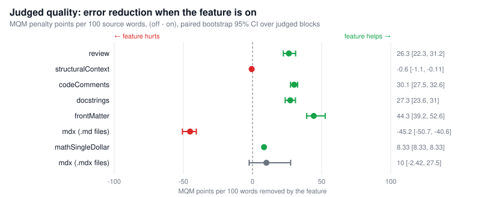
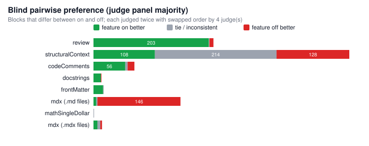
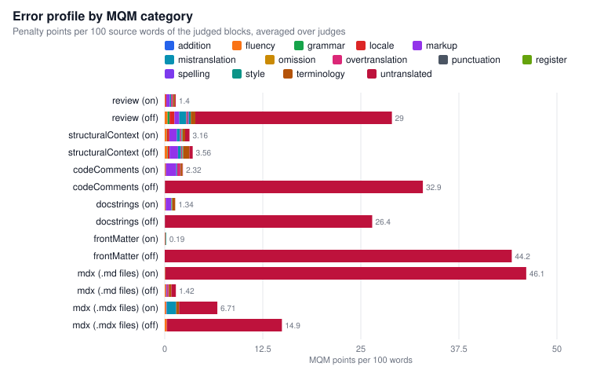
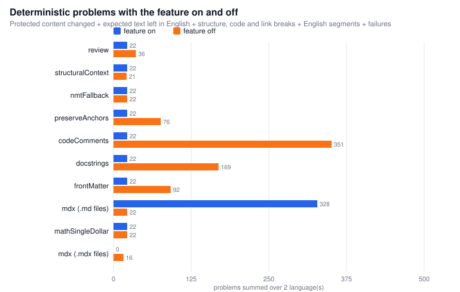
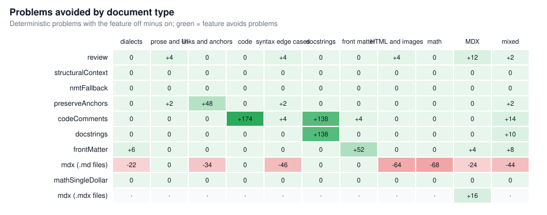
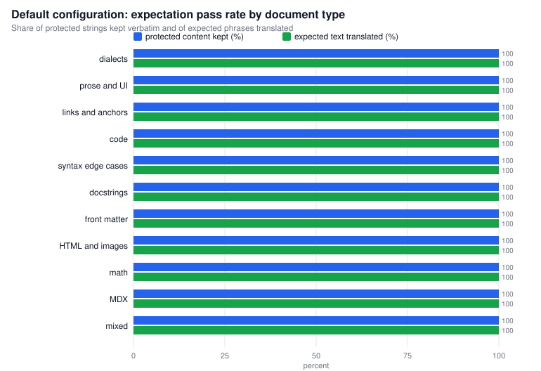
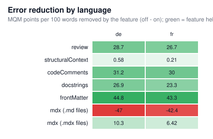
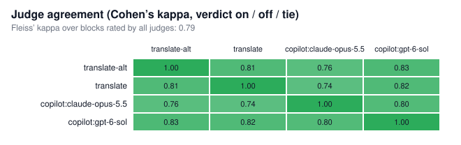
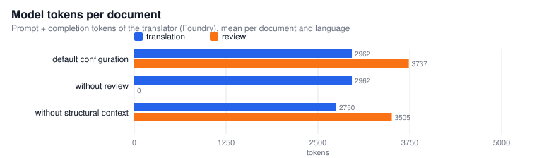

# Translation quality evaluation

Run 2026-09-26 14:08 UTC, commit `d72dbf7+dirty`. 68 English documents translated into de, fr. Translator: Foundry deployment `translate` (reasoning medium), review `translate` (reasoning high). Judges: `translate-alt` (foundry, openai), `translate` (foundry, openai), `copilot:claude-opus-5.5` (copilot, anthropic), `copilot:gpt-6-sol` (copilot, openai).

## Summary

- Regression status: **first run with this output folder, no regression baseline yet**.
- Default configuration: 98.3% of protected strings kept verbatim, 99.7% of expected phrases translated, 90.4% of documents without any defect, 0 structure breaks, 0 changed code blocks, 0 failed documents.
- Evidence differs from the shipped default for: **structuralContext** (shipped on, evidence says off).
- **review** is significantly better with the feature on: won 203, lost 7 (Holm-adjusted p < 0.001), error score 2.71 vs 29.00 per 100 words.
- **codeComments** is significantly better with the feature on: won 56, lost 12 (Holm-adjusted p < 0.001), error score 2.83 vs 32.94 per 100 words.
- **docstrings** is significantly better with the feature on: won 13, lost 1 (Holm-adjusted p 0.005), error score 1.39 vs 28.70 per 100 words.
- **frontMatter** is significantly better with the feature on: won 17, lost 0 (Holm-adjusted p < 0.001), error score 0.11 vs 44.38 per 100 words.
- **mdx (.md files)** is significantly worse with the feature on: won 5, lost 146 (Holm-adjusted p < 0.001), error score 46.69 vs 1.54 per 100 words.

## Feature decisions

Rule: a feature is recommended on when it wins the judged comparison significantly (Holm-adjusted sign test, p < 0.05) or avoids deterministic problems without a significant quality loss; otherwise off. Opposing signals are flagged for manual review. "Not exercised" means the switch changed no output in this corpus, so there is no evidence either way.

| Feature | Shipped | Evidence | Affected docs | Won / tie / lost | Win rate (95% CI) | p (Holm) | MQM on / off | Reduction (95% CI) | Problems on / off |
|---|---|---|---|---|---|---|---|---|---|
| review | on | **on** | 99/136 | 203 / 1 / 7 | 97% (93% to 98%) | < 0.001 | 2.71 / 29.00 | 26.30 (22.27 to 31.17) | 22 / 36 |
| structuralContext | on | **off** (differs) | 127/136 | 108 / 214 / 128 | 46% (40% to 52%) | 0.432 | 3.35 / 2.75 | -0.60 (-1.10 to -0.11) | 22 / 21 |
| nmtFallback | on | **not exercised** | 0/136 | 0 / 0 / 0 | n/a | n/a | n/a | n/a | 22 / 22 |
| preserveAnchors | on | **on** | 132/136 | 0 / 0 / 0 | n/a | n/a | n/a | n/a | 22 / 76 |
| codeComments | on | **on** | 29/136 | 56 / 4 / 12 | 82% (72% to 90%) | < 0.001 | 2.83 / 32.94 | 30.12 (27.49 to 32.63) | 22 / 351 |
| docstrings | on | **on** | 12/136 | 13 / 0 / 1 | 93% (69% to 99%) | 0.005 | 1.39 / 28.70 | 27.31 (23.64 to 31.05) | 22 / 169 |
| frontMatter | on | **on** | 17/136 | 17 / 1 / 0 | 100% (82% to 100%) | < 0.001 | 0.11 / 44.38 | 44.27 (39.17 to 52.57) | 22 / 92 |
| mdx (.md files) | off | **off** | 22/130 | 5 / 2 / 146 | 3% (1% to 8%) | < 0.001 | 46.69 / 1.54 | -45.16 (-50.68 to -40.64) | 328 / 22 |
| mathSingleDollar | off | **off** | 1/136 | 0 / 1 / 0 | n/a | n/a | 2.08 / 10.42 | 8.33 (8.33 to 8.33) | 22 / 22 |
| mdx (.mdx files) | on | **on** | 6/6 | 7 / 5 / 3 | 70% (40% to 89%) | 0.432 | 5.11 / 15.14 | 10.04 (-2.42 to 27.55) | 0 / 16 |

## 1. Judged translation quality

Every block (paragraph, list, table, code block, front matter) whose output differs between the feature on and off is judged blind: each judge sees the English source and both candidates as A and B, twice with the order swapped. A judge's verdict counts only when both orders agree; the panel verdict is the majority of the judges. Error annotations follow MQM (minor 1, major 5, critical 10 points), normalised per 100 source words.





Judges from a different model family than the translator (`copilot:claude-opus-5.5`) guard against self-preference:

| Feature | Independent judges: won / tie / lost | p (unadjusted) |
|---|---|---|
| review | 183 / 21 / 7 | < 0.001 |
| structuralContext | 43 / 358 / 49 | 0.602 |
| codeComments | 55 / 15 / 2 | < 0.001 |
| docstrings | 14 / 0 / 0 | < 0.001 |
| frontMatter | 17 / 1 / 0 | < 0.001 |
| mdx (.md files) | 0 / 7 / 146 | < 0.001 |
| mathSingleDollar | 0 / 0 / 1 | 1.000 |
| mdx (.mdx files) | 6 / 7 / 2 | 0.289 |

Per judge (won / lost with the feature on, sign test):

| Feature | `translate-alt` | `translate` | `copilot:claude-opus-5.5` | `copilot:gpt-6-sol` |
|---|---|---|---|---|
| review | 198 / 6 (p < 0.001) | 196 / 6 (p < 0.001) | 183 / 7 (p < 0.001) | 197 / 7 (p < 0.001) |
| structuralContext | 65 / 83 (p 0.162) | 86 / 112 (p 0.075) | 43 / 49 (p 0.602) | 52 / 71 (p 0.104) |
| codeComments | 56 / 12 (p < 0.001) | 58 / 10 (p < 0.001) | 55 / 2 (p < 0.001) | 56 / 12 (p < 0.001) |
| docstrings | 13 / 1 (p 0.002) | 13 / 1 (p 0.002) | 14 / 0 (p < 0.001) | 13 / 1 (p 0.002) |
| frontMatter | 17 / 0 (p < 0.001) | 17 / 0 (p < 0.001) | 17 / 0 (p < 0.001) | 17 / 0 (p < 0.001) |
| mdx (.md files) | 5 / 144 (p < 0.001) | 5 / 145 (p < 0.001) | 0 / 146 (p < 0.001) | 5 / 145 (p < 0.001) |
| mathSingleDollar | 1 / 0 (p 1.000) | 1 / 0 (p 1.000) | 0 / 1 (p 1.000) | 0 / 1 (p 1.000) |
| mdx (.mdx files) | 7 / 3 (p 0.344) | 6 / 2 (p 0.289) | 6 / 2 (p 0.289) | 6 / 2 (p 0.289) |

## 2. Error profile



## 3. Fidelity and correctness (deterministic)

Checked on every output without a model: expectations in [eval/features/expect.json](../eval/features/expect.json) (strings that must stay byte-identical, phrases that must be translated), Markdown structure re-parsed and compared node by node, code blocks compared after stripping comments and docstrings, in-page links resolved against the translated headings and anchors, and source segments that come back unchanged (English left behind).



| Feature | Protected changed on / off | Not translated on / off | Structure on / off | Code on / off | Links on / off | English segments on / off | Failures on / off | Tokens on / off |
|---|---|---|---|---|---|---|---|---|
| review | 16 / 9 | 2 / 9 | 0 / 0 | 0 / 0 | 0 / 0 | 4 / 18 | 0 / 0 | 911007 / 402793 |
| structuralContext | 16 / 15 | 2 / 2 | 0 / 0 | 0 / 0 | 0 / 0 | 4 / 4 | 0 / 0 | 911007 / 850561 |
| nmtFallback | 16 / 16 | 2 / 2 | 0 / 0 | 0 / 0 | 0 / 0 | 4 / 4 | 0 / 0 | 911007 / 911007 |
| preserveAnchors | 16 / 16 | 2 / 2 | 0 / 0 | 0 / 0 | 0 / 54 | 4 / 4 | 0 / 0 | 911007 / 911007 |
| codeComments | 16 / 15 | 2 / 140 | 0 / 0 | 0 / 0 | 0 / 0 | 4 / 196 | 0 / 0 | 911007 / 812522 |
| docstrings | 16 / 15 | 2 / 60 | 0 / 0 | 0 / 0 | 0 / 0 | 4 / 94 | 0 / 0 | 911007 / 835086 |
| frontMatter | 16 / 16 | 2 / 38 | 0 / 0 | 0 / 0 | 0 / 0 | 4 / 38 | 0 / 0 | 911007 / 849731 |
| mdx (.md files) | 16 / 16 | 112 / 2 | 2 / 0 | 2 / 0 | 0 / 0 | 178 / 4 | 18 / 0 | 745267 / 883063 |
| mathSingleDollar | 16 / 16 | 2 / 2 | 0 / 0 | 0 / 0 | 0 / 0 | 4 / 4 | 0 / 0 | 900184 / 911007 |
| mdx (.mdx files) | 0 / 2 | 0 / 6 | 0 / 2 | 0 / 0 | 0 / 0 | 0 / 6 | 0 / 0 | 27944 / 34317 |



## 4. Default configuration scorecard

| Metric | Value |
|---|---|
| Documents x languages | 136 |
| Protected strings kept verbatim | 98.3% of 926 |
| Expected phrases translated | 99.7% of 686 |
| Documents without defects | 90.4% |
| Structure breaks / changed code blocks / broken links | 0 / 0 / 0 |
| Failed documents | 0 |
| Blocks reverted by the structure check | 0 |
| Segments kept in English after validation | 0 |
| Segments translated by the NMT fallback | 0 |
| English segments left (comment 2, attribute 2) | 4 |
| Tokens per document (mean) | 6699 |
| Seconds per document (median / p90) | 134.0 / 225.2 |



Defects of the default configuration (full list in [data/defects.csv](data/defects.csv)):

| Language | Document | Protected content changed | Expected text not translated | Other |
|---|---|---|---|---|
| de | blog-informal.md | `200,000` |  |  |
| fr | blog-informal.md | `200,000` |  |  |
| de | code-no-lang.md |  | `Show the version` |  |
| fr | code-no-lang.md |  | `Show the version` |  |
| fr | docstrings-numpy.md | `quota_report : ` |  |  |
| de | escapes-entities.md | `\'backticks\'`, `\[brackets\]`, `&lt;tag&gt;` |  |  |
| fr | escapes-entities.md | `\'backticks\'`, `\[brackets\]`, `&lt;tag&gt;` |  |  |
| de | filenames-paths.md | `settings.json and restart` |  |  |
| fr | filenames-paths.md | `settings.json and restart` |  |  |
| de | tables-complex.md | `[Audit log](#audit-log)` |  |  |
| fr | tables-complex.md | `[Audit log](#audit-log)` |  |  |
| de | ui-labels-table.md | `Shift+F5`, `Ctrl+B` |  |  |
| fr | ui-labels-table.md | `Shift+F5` |  |  |

## 5. Breakdown by language



## 6. Judge reliability

| Judge | Provider | Family | Judgements | Failed | Decisive | Position consistency | Agreement with other judges | Cohen’s kappa vs others |
|---|---|---|---|---|---|---|---|---|
| `translate-alt` | foundry | openai | 934 | 0 | 65% | 99% | 87% | 0.80 |
| `translate` | foundry | openai | 934 | 0 | 70% | 97% | 87% | 0.80 |
| `copilot:claude-opus-5.5` | copilot | anthropic | 934 | 0 | 56% | 99% | 78% | 0.67 |
| `copilot:gpt-6-sol` | copilot | openai | 934 | 0 | 63% | 98% | 85% | 0.78 |

Position consistency is the share of decisive judgements where both presentation orders picked the same candidate. Fleiss’ kappa over all judges: 0.78 (0.2 to 0.4 fair, 0.4 to 0.6 moderate, above 0.6 substantial).



## 7. Cost



## 8. Regression report

No earlier run in this folder. This run is the baseline for the next comparison.

## Method

Dimensions measured:

1. **Judged quality**: blind pairwise preference with position swap, panel majority, exact sign test with Holm correction over all features, Wilson 95% interval of the win rate, MQM error score with a paired bootstrap interval (2000 resamples over judged blocks, fixed seed).
2. **Error profile**: MQM categories (mistranslation, omission, terminology, fluency, register, untranslated, overtranslation, markup, ...) weighted by severity.
3. **Fidelity**: deterministic checks that need no model: protected strings, expected translations, Markdown structure, code bytes, in-page links, English left behind, failures.
4. **Robustness**: validation retries, blocks reverted by the structure check, segments kept in English, NMT fallbacks.
5. **Cost**: tokens and wall-clock time per document.
6. **Judge reliability**: position consistency, pairwise Cohen’s kappa, Fleiss’ kappa, per-judge results and a subset of judges from another model family than the translator.
7. **Regression**: every run stores a snapshot in `history/`; the report compares with the previous snapshot and lists new and fixed defects.

Isolation: each feature is flipped alone against the shipped defaults. Segments that the switch does not change are reused from the default run, so differences come from the feature and not from sampling noise. Review off, NMT fallback off and anchors off are derived exactly from the default run.

Limitations: LLM judges instead of professional linguists; judge families overlap with the translator unless independent judges are configured; the corpus is synthetic technical documentation; "affected" features with few differing blocks have wide intervals.

## Reproduce

```powershell
npm install; npm install --prefix eval             # evaluator dependencies (host only, not in the container)
$env:EVAL_LANGS = 'de,fr'
$env:EVAL_JUDGES = 'translate-alt,translate,copilot:claude-opus-5.5,copilot:gpt-6-sol'
npx tsx eval/features.ts                            # translate, check, judge, then write this report
npx tsx eval/report.ts                              # rebuild the report from the latest results
```

See the [README](../README.md#evaluation-and-tests) for all options.

## Data

- [data/feature-summary.json](data/feature-summary.json): every number in this report
- [data/judgements.csv](data/judgements.csv): one row per judged block and judge
- [data/records.csv](data/records.csv): deterministic checks per document, language and feature
- [data/defects.csv](data/defects.csv): defects of the default configuration
- [translations/](translations/): the translated corpus (default configuration) next to the sources in [eval/features/](../eval/features/)
- [history/](history/): snapshots for regression tracking
